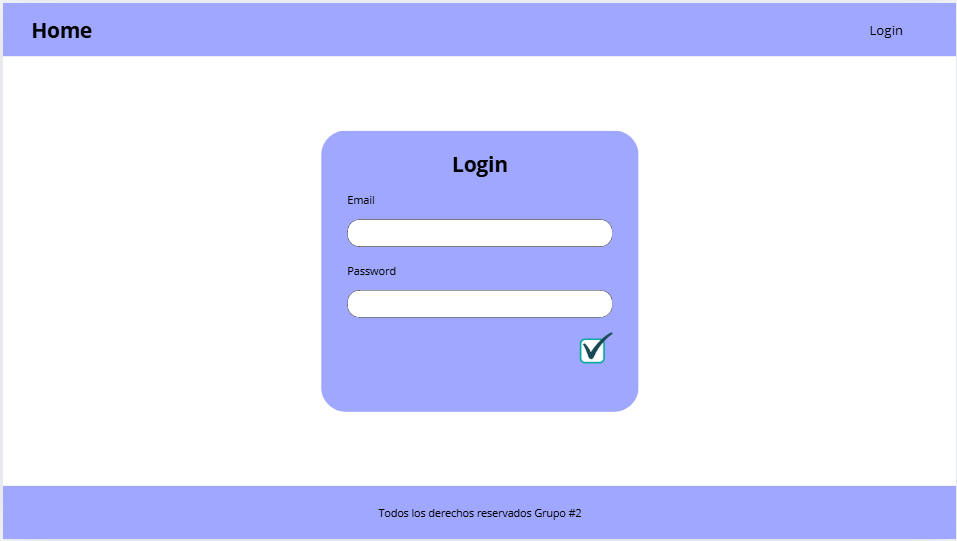

# 📌 Proyecto – Equipo de Trabajo

## 👥 Integrantes del Equipo

| **Nickname** | **Nombre Completo**             | **Carné**    |
| ------------ | ------------------------------- | ------------ |
| mcosigua     | Mario Alejandro Cosigua Pérez   | 6990-24-3754 |
| aestrada     | Alex Daniel Estrada Muñoz       | 6990-24-3754 |
| oramos       | Franklin Omar Ramos Gutiérrez   | _Pendiente_  |
| wsalguero    | William Enrique Salguero Camey  | 6990-24-3465 |
| jhidalgo     | Joseph Alexander Hidalgo de Paz | _Pendiente_  |

---

## 📝 Tareas Asignadas

- **Encargado:** `mcosigua` (apoyado por `oramos`)
- **Fecha de asignación:** `08/09/2025`
- **Tipo:** `Base de Datos (DB)`

### Descripción

El objetivo de esta tarea es **crear procedimientos almacenados** en la base de datos que cumplan con las mismas funciones que actualmente realizan los _queries_ definidos en el archivo:  
📂 [`/db/dml-users.sql`](../db/dml-users.sql)

### Entregables Esperados

1. Scripts SQL con procedimientos almacenados (`.sql`).
2. Validación de que los procedimientos reemplazan correctamente a los _queries_ existentes.
3. Documentación breve de cada procedimiento (nombre, parámetros, retorno).

### 📌 Notas

- Se recomienda mantener la **nomenclatura estandarizada** para los procedimientos (`sp_nombreAccion`).
- Cada integrante debe revisar la compatibilidad con las consultas actuales antes de reemplazarlas.
- Entregables deberán subirse en la carpeta correspondiente dentro del repositorio. Cada commit debe ir de la siguiente forma:
  `nickname:mensaje de commit`.

  _EJE_

  `wsalguero: Commit inicial con proyecto y documentacion creados`

---

- **Encargado:** `jhidalgo`
- **Fecha de asignación:** `08/09/2025`
- **Tipo:** `Front end`

### Descripción

Disenio y creacion del HTML de la pagina del login **(usar prototipo como referencia)**, tag del Navbar y creacion de tag para Sidebar y uno para Footer (siempre un documento `.tag`).

📸[`Prototipo`]

### Entregables Esperados

1. Documentos `.tag` funcionales al momento de ser invocados en el layout.
2. Componentes ui (navbar, sidebar, footer) funcionales y parametrizables (osea que pueda controlarse cosas como el color de fondo, elementos, funcionalidades, etc).
3. Documentación breve de componente creado (sitaxis, explicacion de css si se usa, funcionalidad y integracion con layout).

### 📌 Notas

- Mantener una sintaxis clara de HTML y utilizar los elementos adecuados para cada componente grafico (Por ejemplo para el Sidebar el contenedor principal dever ser un `<aside></aside>`).
- Utilizar un componente ya previamente diseniado de Bootstrap de ser posible, asi como maximizar el uso de Bootstrap y usar CSS solo de ser necesario para cosas mas espesificas que no permita el framework.
- Opciones de menu y contenido que se le agregue a cada elemento (como opciones, textos, hipervinculos quedan a discresion).
- Entregables deberán subirse en la carpeta correspondiente dentro del repositorio. Cada commit debe ir de la siguiente forma:
  `nickname:mensaje de commit`.

  _EJE_

  `wsalguero: Commit inicial con proyecto y documentacion creados`

---
